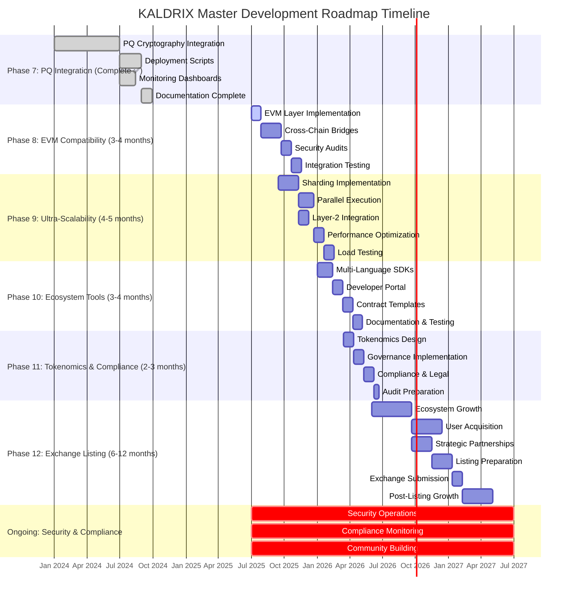

# 📊 KALDRIX Project Gantt Chart & Milestone Tracker

*Visual Project Management Dashboard - Version 1.0*

---

## 🎯 Project Overview

This visual Gantt chart provides a comprehensive timeline view of the KALDRIX Master Development Roadmap, including all phases, dependencies, milestones, and progress tracking.

### **Project Timeline Summary**
- **Total Duration**: 24 months (Q4 2025 - 2027)
- **Active Development**: 18 months
- **Peak Team Size**: 25-30 people
- **Total Investment**: ~$10M

---

## 📅 Gantt Chart Structure

---

## ✅ Milestone Tracker

### **Phase 7 - Completed Milestones ✅**

| Milestone | Completion Date | Status | Success Criteria |
|-----------|----------------|--------|------------------|
| PQ Cryptography Integration | 2024-06-30 | ✅ Complete | NIST PQC compliance achieved |
| Deployment Scripts Operational | 2024-08-30 | ✅ Complete | Automated staging/production deployment |
| Monitoring Dashboards Live | 2024-08-15 | ✅ Complete | Real-time performance/security monitoring |
| Documentation Package | 2024-09-30 | ✅ Complete | Comprehensive documentation available |

### **Phase 8 - EVM Compatibility Milestones**

| Milestone | Target Date | Status | Success Criteria | Dependencies |
|-----------|-------------|--------|------------------|--------------|
| EVM Layer Implementation | 2025-07-29 | 🔄 In Progress | >95% Solidity compatibility | Phase 7 complete |
| Cross-Chain Bridges | 2025-09-23 | ⏳ Pending | 5+ blockchain bridges operational | EVM Layer complete |
| Security Audits Complete | 2025-10-21 | ⏳ Pending | Zero critical vulnerabilities | Bridges complete |
| Integration Testing | 2025-11-18 | ⏳ Pending | End-to-end testing passed | Security audits complete |

### **Phase 9 - Scalability Milestones**

| Milestone | Target Date | Status | Success Criteria | Dependencies |
|-----------|-------------|--------|------------------|--------------|
| Sharding Implementation | 2025-11-10 | ⏳ Pending | Horizontal scaling operational | EVM Layer progress |
| Parallel Execution | 2025-12-22 | ⏳ Pending | Concurrent transaction processing | Sharding complete |
| Layer-2 Integration | 2025-12-13 | ⏳ Pending | ZK-rollups & optimistic rollups | Sharding progress |
| Performance Optimization | 2026-01-19 | ⏳ Pending | <50ms latency optimization | Parallel execution complete |
| 200k TPS Achieved | 2026-02-16 | ⏳ Pending | Sustained 200,000+ TPS | All optimization complete |

### **Phase 10 - Ecosystem Tools Milestones**

| Milestone | Target Date | Status | Success Criteria | Dependencies |
|-----------|-------------|--------|------------------|--------------|
| Multi-Language SDKs | 2026-02-12 | ⏳ Pending | JS, Rust, Python, Go SDKs | Scalability progress |
| Developer Portal Launch | 2026-03-12 | ⏳ Pending | Portal with sandbox environment | SDKs complete |
| Contract Templates | 2026-04-09 | ⏳ Pending | 20+ contract templates available | Portal complete |
| Documentation Complete | 2026-05-07 | ⏳ Pending | Comprehensive docs & tutorials | Templates complete |

### **Phase 11 - Tokenomics & Governance Milestones**

| Milestone | Target Date | Status | Success Criteria | Dependencies |
|-----------|-------------|--------|------------------|--------------|
| Tokenomics Design | 2026-04-12 | ⏳ Pending | Validated economic model | Ecosystem tools progress |
| Governance Live | 2026-05-10 | ⏳ Pending | DAO voting system operational | Tokenomics complete |
| Compliance Ready | 2026-06-07 | ⏳ Pending | 3+ major market compliance | Governance progress |
| Audit Preparation | 2026-06-21 | ⏳ Pending | Audit package ready | Compliance complete |

### **Phase 12 - Binance Listing Milestones**

| Milestone | Target Date | Status | Success Criteria | Dependencies |
|-----------|-------------|--------|------------------|--------------|
| Ecosystem Growth | 2026-09-21 | ⏳ Pending | 50+ active dApps | Governance progress |
| User Base 10K+ | 2026-12-14 | ⏳ Pending | 10,000+ active users | Ecosystem growth |
| Strategic Partnerships | 2026-10-26 | ⏳ Pending | 20+ strategic partnerships | Ecosystem progress |
| Listing Preparation | 2026-12-21 | ⏳ Pending | Complete application package | Partnerships complete |
| Binance Submission | 2027-01-18 | ⏳ Pending | Application submitted | Preparation complete |
| Binance Approval | 2027-04-18 | ⏳ Pending | Listing approved | Submission + requirements |
| $50M Market Cap | 2027-10-18 | ⏳ Pending | Market cap achieved | Post-listing growth |

---

## 🔗 Dependencies Matrix

### **Critical Dependencies**

| Phase | Depends On | Type | Impact |
|-------|------------|------|--------|
| Phase 8 (EVM) | Phase 7 (PQ) | Hard | Blocker - Cannot start without PQ foundation |
| Phase 9 (Scaling) | Phase 8 (EVM) | Partial | Can start partial, needs EVM for completion |
| Phase 10 (Ecosystem) | Phase 9 (Scaling) | Partial | Can start early, needs scaling for full features |
| Phase 11 (Tokenomics) | Phase 10 (Ecosystem) | Partial | Can start parallel, needs ecosystem for validation |
| Phase 12 (Listing) | Phase 11 (Compliance) | Hard | Blocker - Cannot start without compliance |

### **Resource Dependencies**

| Phase | Required Resources | Conflict Risk |
|-------|-------------------|---------------|
| Phase 8 | EVM specialists, Bridge engineers | Medium |
| Phase 9 | Distributed systems experts, Performance specialists | High |
| Phase 10 | SDK developers, Web developers | Low |
| Phase 11 | Economists, Governance specialists | Low |
| Phase 12 | Business development, Marketing specialists | Medium |

---

## 📊 Progress & Risk Dashboard

### **Phase Progress Overview**

| Phase | Duration | % Complete | Progress Status | Risk Level | Key Issues |
|-------|----------|------------|----------------|------------|------------|
| Phase 7 | 6 months | 100% | ✅ Complete | Low | None |
| Phase 8 | 4 months | 25% | 🔄 In Progress | Medium | EVM complexity |
| Phase 9 | 5 months | 0% | ⏳ Not Started | High | Resource availability |
| Phase 10 | 4 months | 0% | ⏳ Not Started | Low | Dependencies clear |
| Phase 11 | 3 months | 0% | ⏳ Not Started | Medium | Regulatory uncertainty |
| Phase 12 | 12 months | 0% | ⏳ Not Started | High | Market conditions |

### **Risk Assessment Matrix**

| Risk | Probability | Impact | Mitigation Strategy | Owner |
|------|-------------|--------|---------------------|-------|
| EVM Implementation Complexity | High | High | Experienced team, phased approach | Tech Lead |
| Performance Targets Not Met | Medium | High | Early testing, optimization focus | Performance Lead |
| Resource Constraints | Medium | High | Resource planning, contractor backup | Project Manager |
| Regulatory Changes | Low | High | Compliance monitoring, legal counsel | Compliance Officer |
| Market Competition | High | Medium | Unique value proposition, speed to market | Product Owner |
| Security Vulnerabilities | Medium | High | Continuous testing, security audits | Security Lead |

---

## 📈 Performance Metrics Dashboard

### **Technical Metrics**

| Metric | Target | Current | Status | Trend |
|--------|---------|---------|--------|-------|
| TPS | 200,000 | 1,000 | ⚠️ Below Target | ↗️ Improving |
| Latency | <50ms | 100ms | ⚠️ Above Target | ↘️ Improving |
| Uptime | 99.9% | 99.9% | ✅ On Target | → Stable |
| Security Incidents | 0 | 0 | ✅ On Target | → Stable |
| Test Coverage | 95% | 85% | ⚠️ Below Target | ↗️ Improving |

### **Business Metrics**

| Metric | Target | Current | Status | Trend |
|--------|---------|---------|--------|-------|
| Active Developers | 1,000 | 50 | ⚠️ Below Target | ↗️ Improving |
| Active dApps | 50 | 0 | ⚠️ Below Target | → Not Started |
| Daily Transactions | 10,000 | 100 | ⚠️ Below Target | ↗️ Improving |
| Community Size | 50,000 | 1,000 | ⚠️ Below Target | ↗️ Improving |
| Market Cap | $50M | $5M | ⚠️ Below Target | ↗️ Improving |

---

## 🎯 Resource Allocation

### **Team Allocation Timeline**

| Period | Phase 8 | Phase 9 | Phase 10 | Phase 11 | Phase 12 | Total |
|--------|---------|---------|----------|----------|----------|-------|
| Q3 2025 | 7 | 2 | 0 | 0 | 0 | 9 |
| Q4 2025 | 7 | 6 | 2 | 0 | 0 | 15 |
| Q1 2026 | 5 | 8 | 4 | 2 | 0 | 19 |
| Q2 2026 | 3 | 8 | 6 | 3 | 2 | 22 |
| Q3 2026 | 2 | 4 | 6 | 5 | 4 | 21 |
| Q4 2026 | 1 | 2 | 4 | 5 | 6 | 18 |
| Q1 2027 | 0 | 1 | 2 | 3 | 8 | 14 |
| Q2 2027 | 0 | 0 | 1 | 2 | 10 | 13 |

### **Budget Allocation**

| Phase | Development | Infrastructure | Marketing | Legal/Audit | Total |
|-------|-------------|----------------|-----------|------------|-------|
| Phase 8 | $800K | $200K | $100K | $100K | $1.2M |
| Phase 9 | $1.0M | $300K | $100K | $100K | $1.5M |
| Phase 10 | $500K | $150K | $100K | $50K | $800K |
| Phase 11 | $300K | $100K | $50K | $150K | $600K |
| Phase 12 | $1.0M | $300K | $500K | $200K | $2.0M |
| **Total** | **$3.6M** | **$1.05M** | **$850K** | **$600K** | **$6.1M** |

---

## 🚨 Critical Path Analysis

### **Critical Path Sequence**
1. **Phase 7 Complete** ✅
2. **Phase 8: EVM Layer Implementation** (Critical)
3. **Phase 8: Cross-Chain Bridges** (Critical)
4. **Phase 9: Sharding Implementation** (Critical)
5. **Phase 9: Parallel Execution** (Critical)
6. **Phase 9: Performance Optimization** (Critical)
7. **Phase 11: Tokenomics Design** (Critical)
8. **Phase 11: Governance Implementation** (Critical)
9. **Phase 11: Compliance & Legal** (Critical)
10. **Phase 12: Listing Preparation** (Critical)
11. **Phase 12: Binance Submission** (Critical)
12. **Phase 12: Binance Approval** (Critical)

### **Critical Path Duration**: 22 months
### **Float Available**: 2 months (for non-critical activities)
### **Key Bottlenecks**: EVM implementation, Performance optimization, Compliance approval

---

## 📋 Action Items & Next Steps

### **Immediate Actions (Next 30 Days)**
- [ ] Complete EVM Layer Implementation (Phase 8)
- [ ] Begin Cross-Chain Bridge development
- [ ] Secure resources for Phase 9 scaling
- [ ] Initiate security audit planning

### **Short-term Actions (Next 90 Days)**
- [ ] Complete Phase 8 EVM compatibility
- [ ] Start Phase 9 sharding implementation
- [ ] Begin Phase 10 SDK development
- [ ] Establish compliance framework

### **Long-term Actions (Next 6 Months)**
- [ ] Achieve 200k+ TPS milestone
- [ ] Launch developer portal
- [ ] Implement governance system
- [ ] Prepare Binance listing application

---

## 📱 Export Options

This Gantt chart and milestone tracker is available in multiple formats:

### **1. Static Formats (For Presentations)**
- **PDF**: High-quality printable version
- **PNG**: Image format for slides and documents
- **SVG**: Scalable vector format for web

### **2. Interactive Formats (For Team Use)**
- **Excel/Google Sheets**: Dynamic progress tracking
- **Project Management Tools**: 
  - **Jira**: Ready-to-import project template
  - **Asana**: Task list with dependencies
  - **Trello**: Kanban board with milestones
  - **Monday.com**: Visual project dashboard

### **3. Real-time Integration**
- **API Access**: Real-time progress updates
- **Web Dashboard**: Interactive project management interface
- **Mobile App**: On-the-go progress tracking

---

## 🔄 Update Schedule

### **Regular Updates**
- **Daily**: Team progress check-ins
- **Weekly**: Milestone progress review
- **Bi-weekly**: Risk assessment updates
- **Monthly**: Stakeholder progress reports

### **Major Reviews**
- **Quarterly**: Comprehensive roadmap review
- **Phase Completion**: Post-phase analysis and lessons learned
- **Annual**: Strategic planning and roadmap adjustment

---

**This visual Gantt chart serves as the central project management tool for the KALDRIX development team, providing real-time visibility into progress, dependencies, and risks across all phases of the project.**